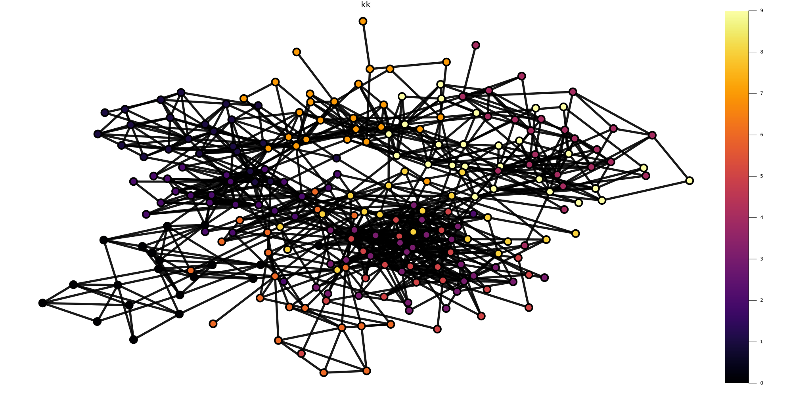

# GraphTDA

This is a Julia based implementation for the framework introduced in [Topological Structure of Complex Prediction](https://arxiv.org/abs/2207.14358). 

The picture below shows the reebgraph for MNIST testset produced by this implementation using probabilities produced by the [log PageRank](https://arxiv.org/abs/2207.11321) mechanism.

With the same example, we show how to use the module in `example.jl` and sample code for producing the picture is in `picturegtda.jl`

It offers functions to analyze embeddings from 3 different procedures : -

1. Diffusion - analyzepredictions(G,X;kwargs...) 
    _Required_ arguments:
    - **G**: The graph structure. We assume this is the adjacency matrix as a sparse CSC matrix that represents an undirected graph. 
    - **X**: The lenses with each lens in a column as a matrix type. These are the embedding vectors obtained from the procedure.
    - **labels**: This is necessary only if the procedure is attempting to analyze predictions; by default, it is an empty list.

    _Optional_ arguments:
    - **labels_to_eval**: The labels/embedding vectors that need to be evaluated. This is the number of coloumns by default.
    - **max_split_size**: This is the largest number of nodes considered inside a reebnode.
    - **overlap**: This values decides the closeness in prediction for data nodes to be considered a part of the same reebnode.
    - **node_size_thd**: This is the smallest number of nodes a reebnode needs to include.
    - **split_thd**: This is the smallest difference between the probabilities the data nodes should have to be considered with different reebnodes.
    - **component_size_thd**: This is the minimum number of original data a component should include to be considered as a reebnode.

2. Neural Networks - analyzepredictions(X;kwargs...) 
     _Required_ arguments:
    - **X**: These are theembedding vectors returned by the neural network.
    - **trainlen** : Number of train examples
    - **testlen** : Number of test examples
    - **labels**: This is necessary only if the procedure is attempting to analyze the error in predictions; by default, it is an empty list.

    _Optional_ arguments:
    - **G**: The graph structure. We assume this is the adjacency matrix as a sparse CSC matrix that represents an undirected graph. 
    - **Same** as in analyzepredictions() 

3. Graph Neural Networks - analyzepredictions(X;kwargs...) 
     _Required_ arguments:
    - **X**: These are the embedding vectors returned by the graph neural network.
    - **trainlen** : Number of train examples
    - **testlen** : Number of test examples
    - **labels**: This is necessary only if the procedure is attempting to analyze the error in predictions; by default, it is an empty list.

    _Optional_ arguments:
    - **G**: The graph structure. We assume this is the adjacency matrix as a sparse CSC matrix that represents an undirected graph. 
    - **Same** as in analyzepredictions() 

